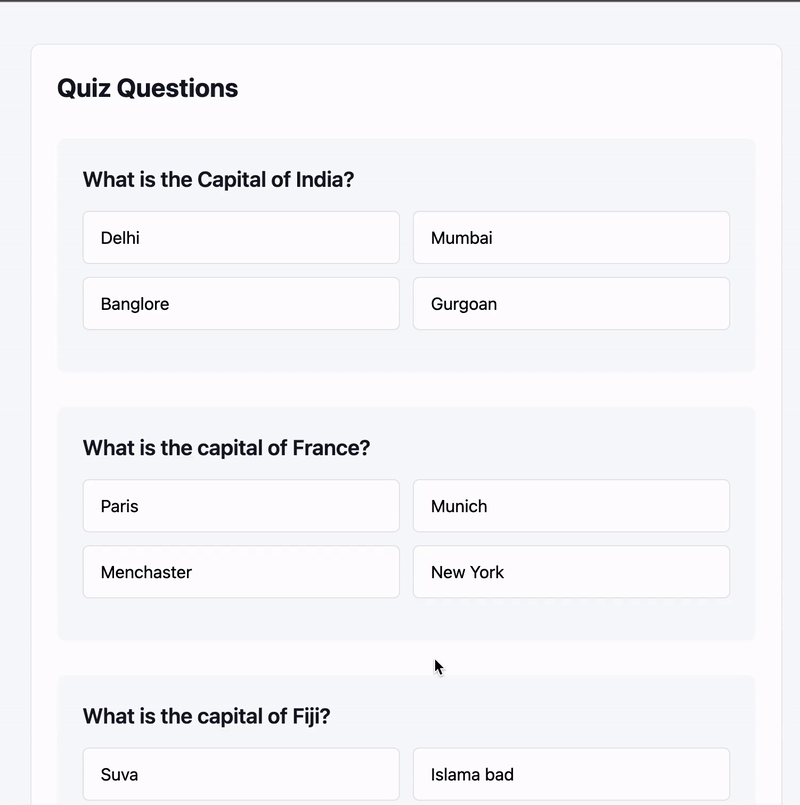

# Quiz Application with Go & HTMX

A lightweight quiz application built with Go and HTMX that allows users to create, manage, and take quizzes in real-time. The application demonstrates rapid development and simple interactivity without complex JavaScript frameworks.



## Technologies Used

- [Go](https://golang.org/) - Backend server and API
- [HTMX](https://htmx.org/) - Frontend interactivity without JavaScript
- [PostgreSQL](https://www.postgresql.org/) - Database
- [TailwindCSS](https://tailwindcss.com/) - Styling

### Why HTMX?

HTMX offers a simpler alternative to heavy JavaScript frameworks for basic web applications. While not as feature-rich as React or Flutter Web, it excels at:
- Rapid prototyping
- Server-side rendering
- Minimal client-side complexity
- Reduced development overhead

## Quick Start

### 1. Database Setup
```sh
# Connect to PostgreSQL
psql -h <hostname> -U <username> -d <database>

# Create user and database
CREATE USER quiz_user WITH PASSWORD 'your_password';
CREATE DATABASE quiz_db;
GRANT ALL PRIVILEGES ON DATABASE quiz_db TO quiz_user;
```

### 2. Run Application
```sh
go run main.go
```

Visit `http://localhost:8084` in your browser.

 
## Contributing

Contributions are welcome! Feel free to submit issues, create pull requests, or propose new features to improve the application.